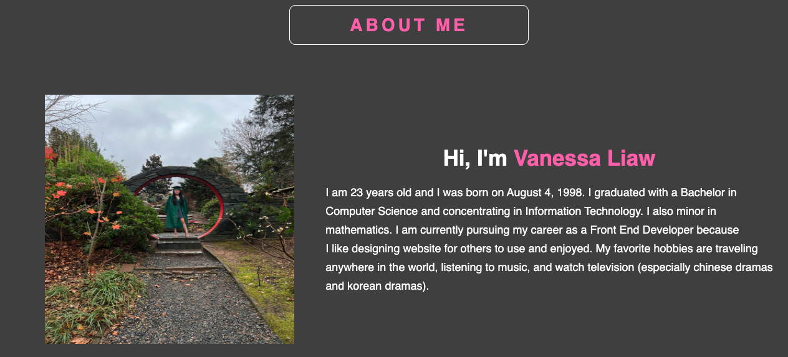
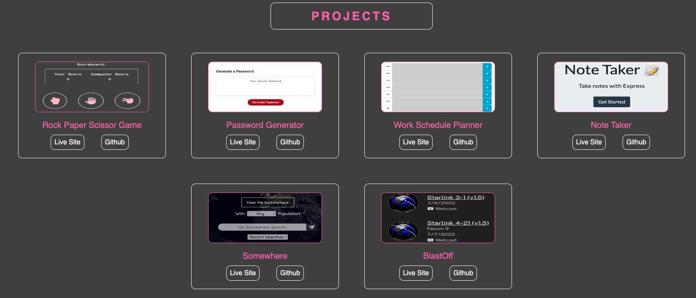
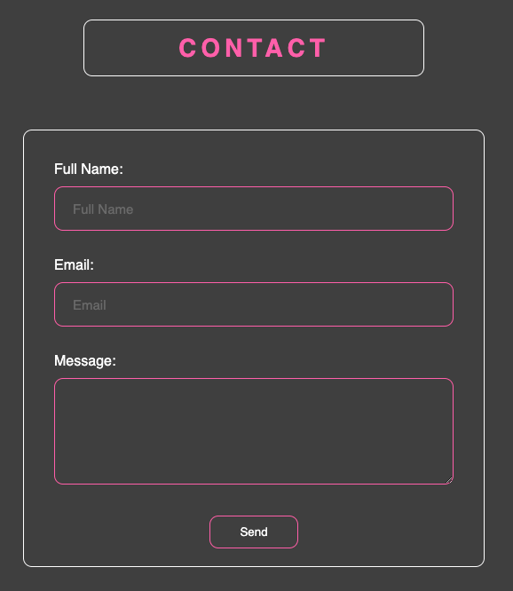
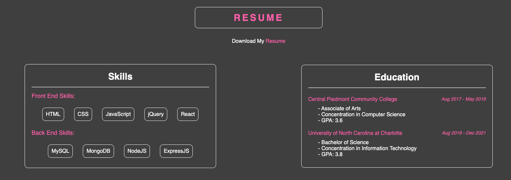

# React-Portoflio

## Table of Content

- [Description](#description)
- [Visuals](#visuals)
- [Resources](#resources)
- [Authors and Acknowledgement](#authors-and-acknowledgement)

## Description 

This is my portfolio website that will let employers know about me, the projects I've done, a way to contact me and a resume of my works and experience. This application is using react to build my portfolio and show off my react skills. 

## Visuals

This is the about page 

This is the projects page 

This is the contact page

This is the resume page

## Resources 

- [GitHub Repo](https://github.com/VanessaLiaw021/react-portoflio)

- [Live Site](https://vanessaliaw021.github.io/react-portoflio/)

## Authors and Acknowledgement

Coded and Design by Vanessa Liaw